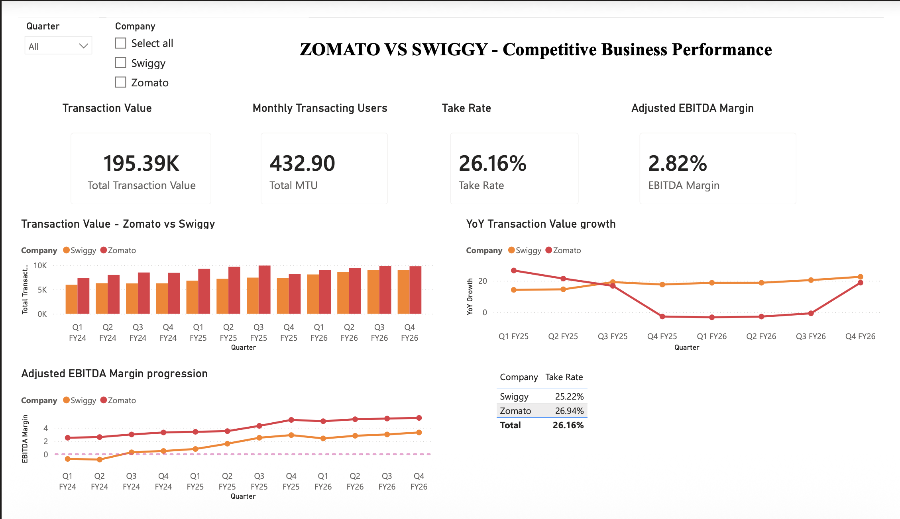
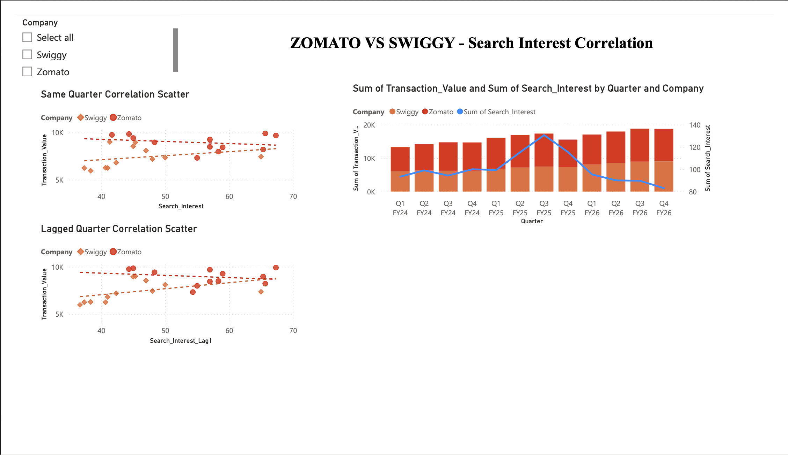

# Zomato vs Swiggy: Food Delivery Competitive Growth Analytics (FY24 - FY26)

This repository contains a competitive growth analytics project comparing India's food delivery leaders, **Zomato** and **Swiggy**. It integrates Google Trends search interest data with quarterly financial performance metrics to evaluate scale, growth, monetization, and search interest leading indicators.

---

## 1. What We Built
We built an integrated analytics repository that aligns and merges two datasets:
1. **Digital Interest Layer (Google Trends)**: Monthly search interest index for "Zomato" and "Swiggy" in India.
2. **Financial Performance Layer**: Quarterly financial outcomes, including Transaction Value, Monthly Transacting Users (MTUs), Adjusted Revenue, and EBITDA margins.

By mapping the monthly search index into the Indian fiscal calendar (April to March), we aggregated the search index into quarterly averages and merged these datasets into a 24-row master table to analyze operational trends and test if web search momentum acts as a leading indicator of forward business metrics.

---

## 2. Results
The analysis answers exactly five core business questions:

1. **Market Scale & Growth**: Zomato leads in scale (Q4 FY26 Transaction Value: 9,757 Cr vs Swiggy's 9,005 Cr), but Swiggy is growing faster (+22.57% YoY growth vs Zomato's 18.84%), narrowing the absolute scale gap from 1,359 Cr in Q1 FY24 to 752 Cr in Q4 FY26.
2. **User Traction & Engagement**: Zomato holds a larger active user base (25.4M vs Swiggy's 18.3M MTUs). For both companies, user scale is the direct driver of transaction volume (correlation $>0.96$).
3. **Monetization & Revenue Efficiency**: Zomato exhibits superior pricing power, averaging a 26.83% take rate (peaking at 32.03% in Q4 FY26). Swiggy's take rate is stable and range-bound around 25.16%.
4. **Profitability Path**: Zomato maintains higher EBITDA margins (5.5% in Q4 FY26). Swiggy improved faster (+4.0 pp gain vs Zomato's +3.0 pp) but operates at a lower absolute level (3.3%).
5. **Search Interest as a Leading Indicator**: For Swiggy, search interest is a strong leading indicator. Lagging search interest by 1 quarter increases its correlation with Transaction Value from 0.2878 to **0.4472**. For Zomato, search interest has decoupled (-0.23 correlation), indicating mature direct-to-app habits.

---

## 3. Dashboard Screenshots and Report Links

### Power BI Dashboard Page 1: Competitive Business Performance

### Power BI Dashboard Page 2: Search Interest Correlation

### Project Report
*   [Zomato vs Swiggy Food Delivery Analysis Report (PDF)](reports/Zomato_vs_Swiggy_Food_Delivery_Analysis.pdf) - Detailed report outlining methodology, analysis, and recommendations.

*(Note: Please ensure the dashboard screenshot image files are saved locally as `images/dashboard_page_1.png` and `images/dashboard_page_2.png` inside the repository folder to display them on GitHub.)*

---

## 4. Decisions and Tech Stack

### Key Business & Product Decisions
*   **Zomato App-Direct Strategy**: Since search volume has decoupled from performance, Zomato should focus product efforts on in-app loyalty (Zomato Gold) and active user retention rather than web-search marketing.
*   **Swiggy Campaign Alignment**: Since search interest acts as a 1-quarter leading indicator of sales for Swiggy, marketing campaigns should be planned to pre-emptively build driver capacity and delivery readiness.
*   **Take Rate Pricing**: Zomato can defend its 32.03% take rate by offering value-added services to vendors, while Swiggy should test pricing elasticity to expand its take rate from the current 25.59%.

### Tech Stack
*   **Dashboard Visualizations**: Power BI (Custom layouts, time-sorting configurations, and DAX measures)
*   **Data Preparation & Statistics**: Jupyter Notebooks, Python (Pandas, Numpy, Seaborn, Matplotlib)
*   **PDF Report Generation**: FPDF2, PyMuPDF
